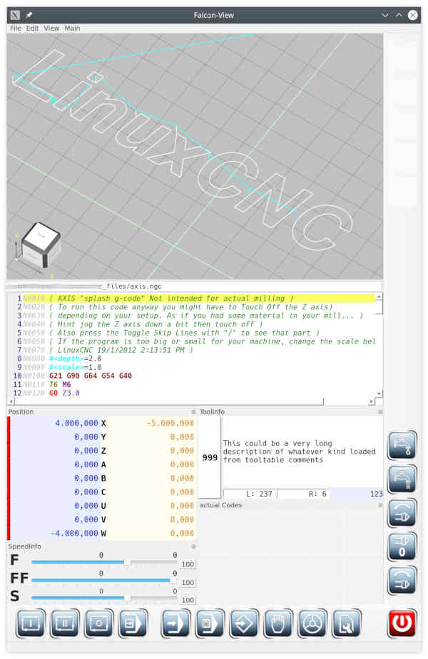
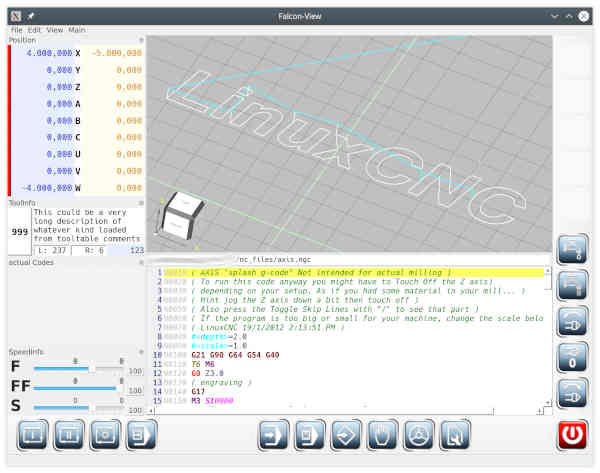

# FalconView

**Work in progress!**

Controlcenter for machines controlled by **linuxCNC**.
Subwindows like position or speed override can arranged anywhere
around the central preview pane.

## Screenshot

## Build

**FalconView** uses these dependencies:

- [linuxCNC](https://github.com/LinuxCNC/linuxcnc) - does not work from dev-packages,
  so you need a source distribution and compile it on your own. Development with
  *linuxCNC* works from so called *RIP*-installation only.
  (RIP = run in place)
  Add a softlink to your linuxcnc installation in the project directory (FalconView)
  called *lc*

- [openCascade](https://git.dev.opencascade.org/repos/occt.git) works fine from
  distrubution packages. I used a github clone to be able to debug work.
  Edit *FalconView.pro* and change INCLUDEPATH- and LIBS-entry for your *occt* installation.

- [Qt](https://www.qt.io/download) works fine from distribution packages as well as
  from Qt-binary download-center.

  **NOTE:** You have to use Release 5.xx, as opencascade is not ready for Qt6.xx

- *QtCreator* - optional. I have very good experience with using QtCreator. It's not
  that powerful as *Eclipse* (yet?), but it really helps on development and debugging.

