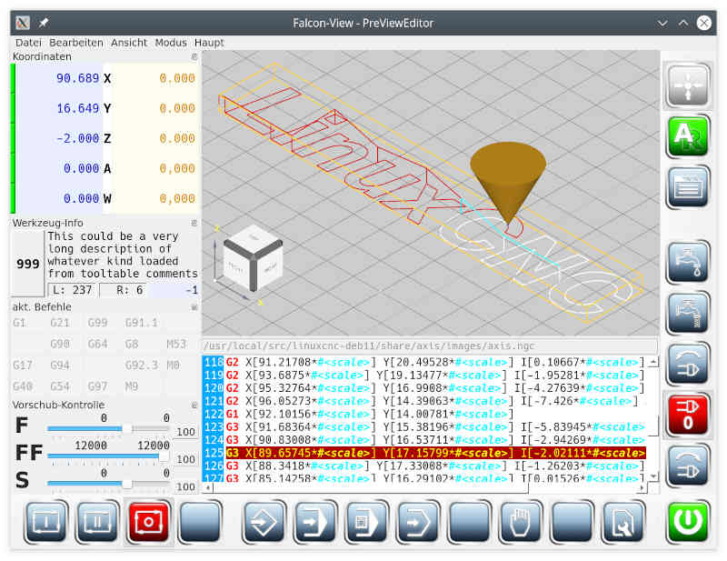
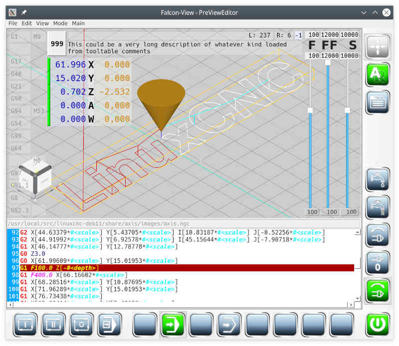

# FalconView

**Work in progress!**

Controlcenter for machines controlled by **linuxCNC**.
Subwindows like position or speed override can arranged anywhere
around the central preview pane.
Alternatively, the status displays can be shown in the 3D preview.

## update 01.2022
- migrated to cmake build system (tested from commandline as well as from QtCreator)
- most main pages are plugins, that get loaded at runtime
- general toolmanager is able to generate tooltable for linuxCNC
- helpfile is complete for every available page and translated in english and german
- basic functions are already tested against LinuxCNC
- screen configuration is saved at application exit, so that it comes up as left

## Build

### Build-Dependencies

**FalconView** uses these dependencies:

- [linuxCNC](https://github.com/LinuxCNC/linuxcnc) - does not work from dev-packages,
  so you need a source distribution and compile it on your own. Development with
  *linuxCNC* works from so called *RIP*-installation only.
  (RIP = run in place)

- [openCascade](https://git.dev.opencascade.org/repos/occt.git) works fine from
  distrubution packages. I use selfcompiled release 7.6.0 from github to be able
  to debug work.

- [Qt](https://www.qt.io/download) works fine from distribution packages as well as
  from Qt-binary download-center.

  **NOTE: You have to use Release 5.xx, as opencascade is not ready for Qt6.xx**

- *QtCreator* - **optional**. I have pretty good experience with using QtCreator.
  It's not that powerful than *Eclipse* (yet?), but it really helps on
  development and debugging.

- [Atom](https://atom.io/) - **optional**. Very nice editor for markdown files with live preview.

### Build-Setup
**FalconView** consists of several sub-projects. I hope, that separation helps in
understanding and may serve as a blueprint for extensions.
*qmake* is not able to handle the dependencies of subprojects, so I migrated to *cmake*.
*cmake* is a challenge to start with. Its huge, hard to understand and a lot of
internal behaviour is not documented, or behaviour is different to documentation ...
So I had to find my own way to get what I wanted.

*sample* directory contains two cmake files:

- FalconView.cmake
- FindlinuxCNC.cmake

To get *cmake* find these files, you have to copy those files somewhere and tell *cmake* the **absolute path** of the directory, where you put them.

Edit top-level **CMakeLists.txt** and change some settings to reflect your system:

- *CMAKE_MODULE_PATH* to the path, where you put both files from *sample*.
- *CMAKE_PREFIX_PATH* to the paths of Qt-toolkit and opencascade.
- *OpenCASCADE_DIR* is the directory, where cmake files from opencascade are.
- *EMC2_HOME* base directory of your *linuxCNC* **RIP**-installation.

## Screenshot
- a vertical configuration

- a horizontal configuration

- a configuration with inline status controls

