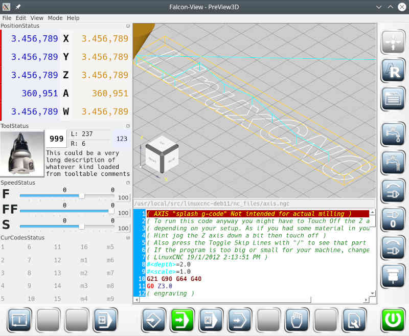
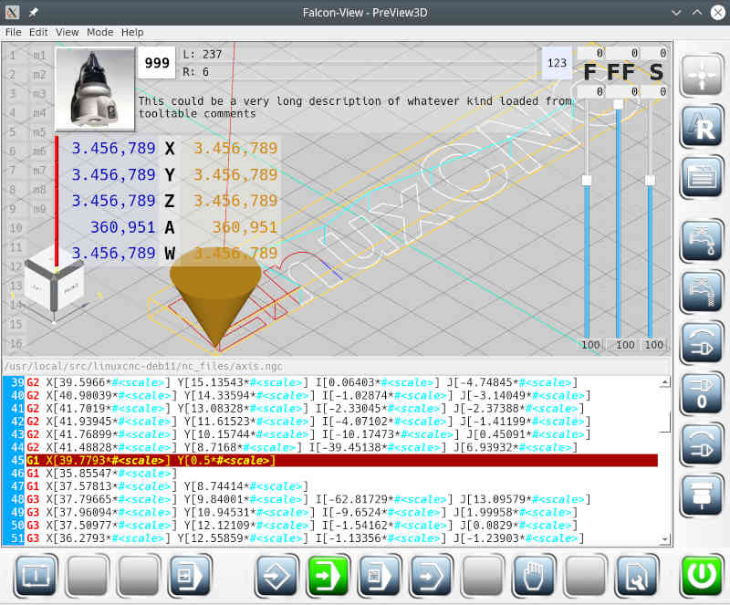
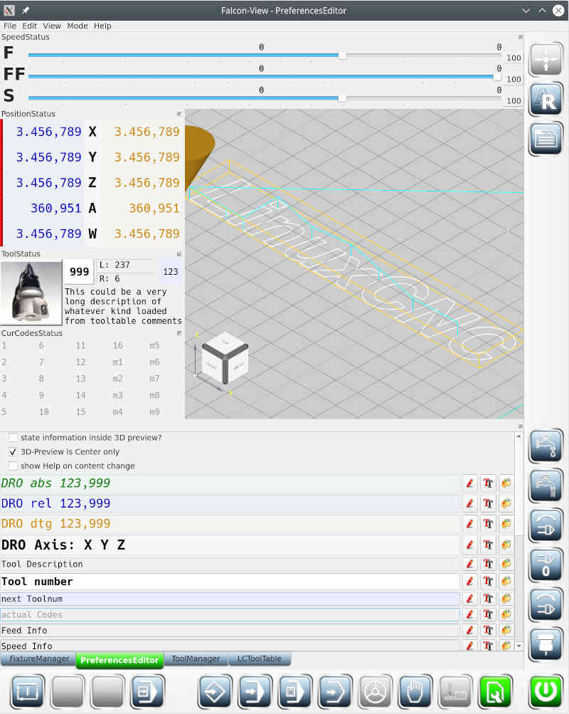

# FalconView

Controlcenter for machines controlled by **linuxCNC**.
Subwindows like position or speed override can arranged anywhere
around the central preview pane.
Alternatively, the status displays can be shown in the 3D preview.

## Build

### Build-Dependencies

**FalconView** uses these dependencies:

- [linuxCNC](https://github.com/LinuxCNC/linuxcnc) - does not work from dev-packages,
  so you need a source distribution and compile it on your own. Development with
  *linuxCNC* works from so called *RIP*-installation only.
  (RIP = run in place)

- [openCascade](https://git.dev.opencascade.org/repos/occt.git) works fine from
  distrubution packages. I use selfcompiled release 7.6.0 from github to be able
  to debug work.

- [Qt](https://www.qt.io/download) works fine from distribution packages as well as
  from Qt-binary download-center.

  **NOTE: You have to use Release 5.xx, as opencascade is not ready for Qt6.xx**

- *QtCreator* - **optional**. I have pretty good experience with using QtCreator.
  It's not that powerful than *Eclipse* (yet?), but it really helps on
  development and debugging.

- [Atom](https://atom.io/) - **optional**. Very nice editor for markdown files with live preview.

### Build-Setup
**FalconView** consists of several sub-projects. I hope, that separation helps in
understanding and may serve as a blueprint for extensions.
*qmake* is not able to handle the dependencies of subprojects, so I migrated to *cmake*.
*cmake* is a challenge to start with. Its huge, hard to understand and a lot of
internal behaviour is not documented, or behaviour is different to documentation ...
So I had to find my own way to get what I wanted.

*sample* directory contains two cmake files **indispensable for successful build**:

- FalconView.cmake
- FindlinuxCNC.cmake

To get *cmake* find these files, you have to copy those files somewhere and tell *cmake* the **absolute path** of the directory, where you put them.

Edit top-level **CMakeLists.txt** and change some settings to reflect your system:

- ***CMAKE_MODULE_PATH*** to the path, **where** you put **both files from** ***sample***.
- ***CMAKE_PREFIX_PATH*** to the paths of Qt-toolkit and opencascade.
- ***OpenCASCADE_DIR*** is the directory, where cmake files from opencascade are.
- ***EMC2_HOME*** base directory of your *linuxCNC* **RIP**-installation.

Build ends with a copy stage, which creates a directory ***dist*** in your build-tree, which contains all binaries ready to be called without additional commandline arguments.
So from your buildroot you can start **FalconView** with:
```
dist/FalconView -ini <path to your linuxCNC-ini-file>
```

#### Note:
```
cmake works best with a buildroot outside of the source tree.
```

## Application start
### Integrated
**FalconView** has been created to get integrated into linuxcnc start process, so the call is:

```
FalconView -ini <path to your linuxCNC-ini-file>
```
You can add FalconView to ini-file from *linuxCNC*. See *linuxCNC* [online docs](https://linuxcnc.org/docs/devel/html/config/ini-config.html) for further informations.

### manual start
**FalconView** could be started manually too:
```
FalconView V0.1

please specify the path to INI-file of your linuxCNC machine.

supported options:
        -ini            <mandatory>     path to INI-file of linuxCNC
        -help           [optional]      path to FalconView helpfile
        -plugins        [optional]      path to plugin-directory
        -i18n           [optional]      path to translation files
```
When you start FalconView from the dist directory, you only have to specify the path to your linuxcnc ini-file. All other requirements are found relatively to the applcations executable.

## [Extending FalconView](EXTENDING.md)

## Layout variants
### default
Preview is a splitted page with 3D-View on top and GCode-Viewer below. Switching to other pages hides 3D-View. Status-Info windows are floatable subwindows, that can be arranged around (fixed) center view or placed at the desktop.

[](sample/FalconView01.jpg)
### variant 1: status inside 3D-Preview
No more floating subwindows. All status infos are shown as overlay to the 3D-View. 3D-View and GCode-Viewer are still 2 parts of the same page. So changing to another page will hide 3D-View.
[](sample/FalconView02.jpg)

### variant 2: center is 3D-Preview only
Now the formerly center pages are placed in a floating subwindow, so it can be liberately placed somewhere around the 3D-View or put somewhere on the desktop. As other floating subwindows can do.
[](sample/FalconView03.jpg)
