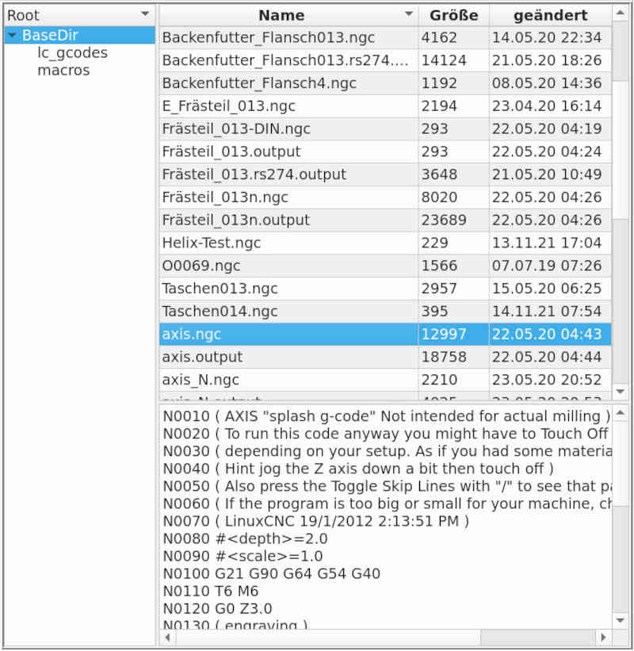

# File manager

The file manager is used by the editors to select a file. By selecting the directory and then selecting the file, the desired file can be determined. **[Enter]** completes the selection and loads the file.

The file manager shows the directories in a tree structure on the left. As protection, only directories below the one specified (at linuxCNC in the ini file) are displayed. No other directories or paths can be entered. The main directory can be seen as folder for GCode files.

## The following functions/key-strokes are supported:

- **[Insert]** - in the directory tree creates a new directory. The same keystroke in the file list creates a new file.

- **[Arrow up/down]** - change current directory or file.

- **[Tab]** - switches between the directory view and the file list (top right). In the file list the files of the selected directory are displayed.

- **[Del]** - in the directory tree deletes a directory (only if it is empty) and [Del] in the file list deletes the file.

- **[F5]** - in the file list marks a file to *copy*.

- **[F6]** - in the file list marks a file to *Move*.

 **Copy** and **Move** are two-step operations: first a file must be **marked**. Then the **destination directory must be selected** in the directory tree. If **[Enter]** is pressed on the target directory, the operation is executed.
