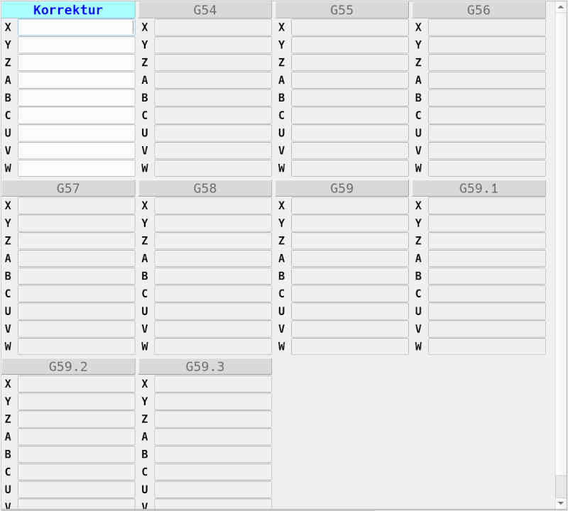

# Fixture-Manager

Under **Fixture-Manager** the zero points for different coordinate systems can be managed. The manager offers 10 editors. The number of input fields
depends on the configured axis of the machine. For a machine with 3 axes
3 input fields are offered, for one with 9 axes 9 input fields.

The first editor is intended for relative fixtures, which are applied to all coordinate systems.
**G54** is the first coordinate system and can be activated via the key combination **[Ctrl+1]**.
Correspondingly, **[Ctrl+2]** applies to **G55**, and so on.
**[Ctrl+0]** applies to the relative fixtures.
**[Tab]** switches between the input fields.

## Mode of operation

Move the machine to the desired position (of an axis). Then
select the desired coordinate system. The editor will be activated. Enter the value, you'd like to see in the display at this location. Usually you will want to enter **0**. The editor converts the input into the machine coordinate system and the display of the relative position then shows the desired value.

If, for example, you want to place the zero point in the center of the workpiece, probed one side and enter **0**. Then move to the opposite side. If the relative position display shows the value *184.6* - divide that value by 2 and enter result in the corresponding input field. In this case enter *92,3*.
When you then move to the center of the workpiece, relative axis display will show *0*.
