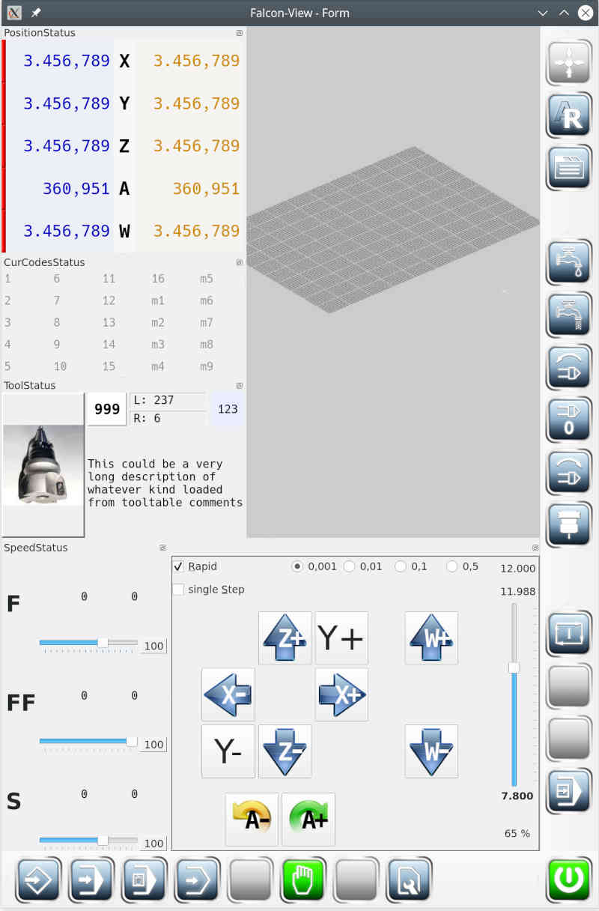

# User Manual FalconView

**FalconView** is a client application for the operation of CNC machines, which are controlled by
*linuxCNC*.

**FalconView** is designed for a multiclient environment, which means that the application may feel different than usual desktop applications. Specifically this means commands are sent to the *linuxCNC* server and **FalconView** processes the response from the server.
Likewise, a second client application can send commands to the *linuxCNC*-
server, which results in status changes which are displayed by **FalconView**.

**Note:** see [Integration of **FalconView** in linuxCNC](integration)

To make it easier to learn how to use **FalconView**, a corresponding help is displayed at page change. There the operation by keyboard shortcuts
is described.

If you don't want the help to be shown at every page change, you can change this in the settings
.

Of course help can be displayed at any time by pressing **[F1]**.

## Structure of the application

the default appearance of **FalconView** looks like this:

- the *red area* (1) is the fixed [**main application area**](reference).
This can be an editor, the 3D preview or any other entity that processes user input.

- the *blue area* (2-5) are the *command buttons* arranged in so-called [**toolbars**](toolbars). The individual toolbars can be **moved** or otherwise arranged around the *main application area*.
around the main application area. They can also be placed anywhere on the screen.

- the green area (6-9) are [**status information**](info) about the machine condition.
These mini windows can be **freely moved** (like the toolbars) and arranged around the central "main application area". If two mini windows are placed on top of each other, a notebook with several tabs is automatically created.
tabs.

## Variant 1

If it is selected in the settings that **status outputs are to be displayed within the
3D preview**, then the appearance changes as follows. This setting can be advantageous for small screens.

## Variant 2

In the settings you can select that only the 3D preview shows the application center. Then the editors and other main windows are displayed in a movable auxiliary window, which can be moved **at will**.

