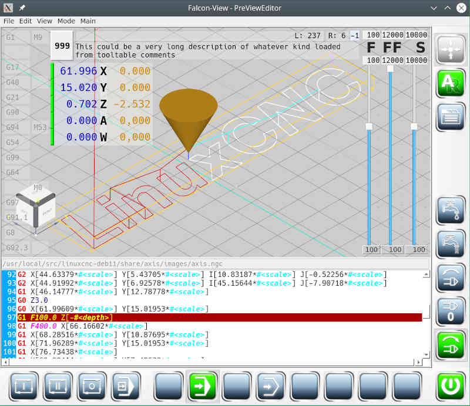

# Benutzerhandbuch FalconView

**FalconView** ist eine Client-Anwendung zur Bedienung von CNC-Maschinen, welche mit
*linuxCNC* gesteuert werden.

**FalconView** wurde für eine Multiclient-Umgebung entworfen, was bedeutet, dass sich
die Anwendung anders anfühlt, als übliche Desktop-Anwendungen. Konkret bedeutet das,
dass Befehle zum *linuxCNC*-Server geschickt werden und **FalconView** die Antwort
verarbeitet. Genauso kann eine zweite Client-Anwendung Befehle an den *linuxCNC*-
Server schicken, welches Statusänderungen zur Folge hat, die in **FalconView**
angezeigt werden.

**Hinweis:** siehe [Einbindung von **FalconView** in linuxCNC](integration)

Zum leichteren Erlernen der Bedienung von **FalconView** wird bei jedem Seitenwechsel
die dazugehörige Hilfe eingeblendet. Dort wird die Bedienung per Tastaturkürzel
beschrieben.
Soll die Hilfe nicht weiter angezeigt werden, kann dies in den Einstellungen
 abgestellt werden.

Trotzdem kann zu jedem Zeitpunkt die Hilfe mit **[F1]** wieder angezeigt werden.

## Aufbau der Anwendung

das Standard-Erscheinungsbild von **FalconView** sieht folgendermaßen aus:

- der *rote Bereich* (1) ist der [**Hauptanwendungbereich**](reference).
Dies kann ein Editor, die 3D-Vorschau oder sonst ein Gebilde sein, welches Benutzereingaben verarbeitet.

- der *blaue Bereich* (2-5) sind die *Befehlstasten* in sogenannten [**Werkzeugleisten**](toolbars) angeordnet. Die einzelnen Werkzeugleisten können beliebig verschoben oder anderweitig rund um den *Hauptanwendungsbereich*
angeordnet werden. Sie können aber auch frei auf dem Bildschirm platziert werden.

- der grüne Bereich (6-9) sind [**Status-Informationen**](info) zum Maschinenzustand.
Diese Minifenster können (wie die Werkzeugleisten) frei verschoben und rund um
den zentralen "Hauptanwendungbereich" angeordnet werden. Werden zwei Minifenster
übereinander platziert, dann entsteht automatisch ein Notebook mit mehreren
Reitern.

**Wird in den Einstellungen ausgewählt, dass Statusausgaben innerhalb der
3D-Vorschau angezeigt werden sollen, dann ändert sich das Erscheinungsbild folgendermaßen:**

