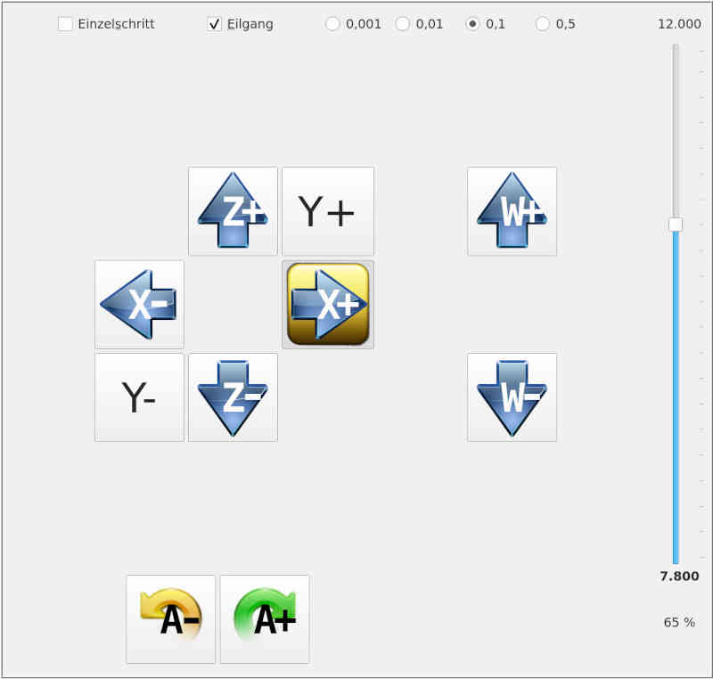

# Manual mode

This page is used to move the machine by pressing a button. There are different types of movement:
- At the push of a button, the relevant axis moves by one step (**single step**), whereby the step size is adjustable (top right).
- At the push of a button, the machine moves until **Stop** is pressed.

The movement can take place either at the configured speed for manual operation, or at rapid traverse, i.e. at max. possible speed.

Again, only the buttons for the configured axes of the machine are displayed.

The identifier of the axis serves as keyboard shortcut, whereby the lower case letters for
positive direction and the capital letters for negative direction. So a
small **x** moves the X-axis in positive direction, a capital **X** moves the
X-axis in negative direction (capital X means *Shift* + *x*).
