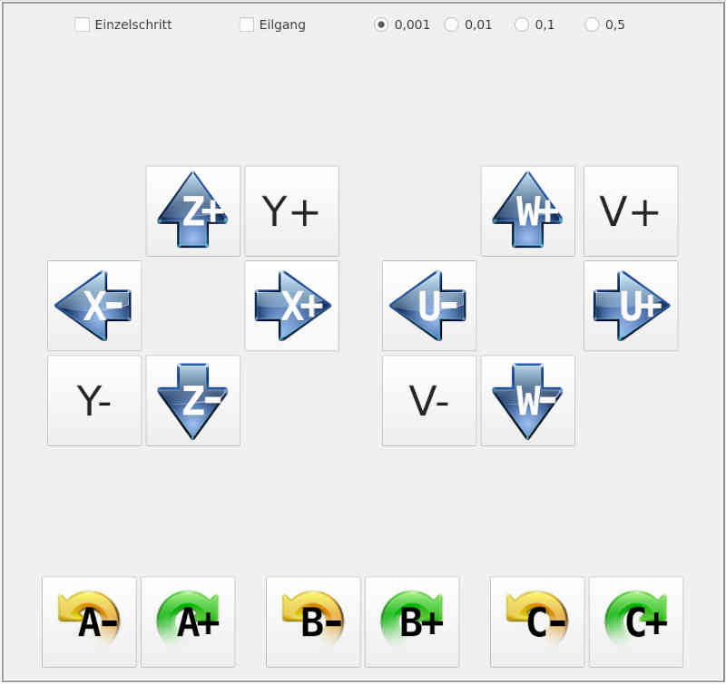

# Handbetrieb

Diese Seite dient dem Verfahren der Maschine auf Knopfdruck. Dabei gibt es unterschiedliche Bewegungsarten:
- Auf Knopfdruck bewegt sich die betreffende Achse um einen Schritt (**Einzelschritt**), wobei die Schrittgröße einstellbar ist (rechts oben).
- Auf Knopfdruck bewegt sich die Maschine solange, bis **Stop** gedrückt wird.

Die Bewegung kann dabei entweder mit der konfigurierten Geschwindigkeit für Handbetrieb erfolgen, oder aber im Eilgang, d.h. mit max. möglicher Geschwindigkeit.

Auch hier gilt wieder, dass nur die Knöpfe für die konfigurierten Achsen der
Maschine angezeigt werden.

Als Tastaturkürzel dient der Bezeichner der Achse, wobei die Kleinbuchstaben für
positive Richtung und die Großbuchstaben für negative Richtung stehen. Also ein
kleines **x** bewegt die X-Achse in positive Richtung, ein großes **X** bewegt die
X-Achse in negativer Richtung (Großes X bedeutet *Umschalttaste* + *x*).
