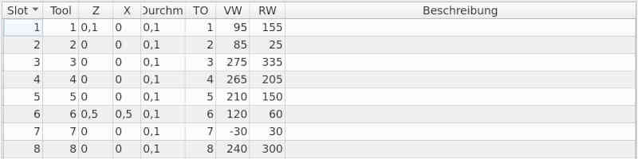

# Tool management for linuxCNC

The tool management of the linuxCNC tools is available in two different
versions (depending on which machine is configured).
The fields can be edited in the table. The list then changes to
edit mode. **[F10]** saves the change, **[Esc]** discards the change.

- Tool management for lathes

The fields in detail:

  - *Slot* is the place in the turret
  - *Z* the offset in Z direction
  - *X* is the offset in X-direction
  - *Diameter* is the diameter at the tool tip
  - *Q* is the quadrant of the tool orientation
  - *FA* is the front angle
  - *BA* is the back angle

- Tool management for milling

The fields in detail:

  - *Slot* is the place in the tool changer
  - *Length* is the length in Z-direction
  - *Diameter* is the tool diameter
