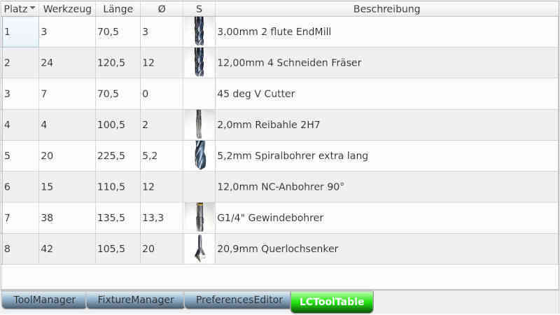

# Tool management for linuxCNC

The tool management of the linuxCNC tools is available in two different
versions (depending on which machine is configured).
The fields can be edited in the table. The list then changes to
edit mode. **[F10]** saves the change, **[Esc]** discards the change.
change.

## Tool management for lathes


The fields in detail:

  - *Place* is the place in the turret.
  - *Z* the offset in Z direction
  - *X* is the offset in X-direction
  - *Diameter* is the diameter at the tool tip
  - *Q* is the quadrant of the tool orientation
  - FW* is the front angle
  - RW* is the back angle


## Tool management for milling



The fields in detail:

  - *Place* is the place in the tool changer
  - *Length* is the length in Z direction
  - *Diameter* is the tool diameter
  - *S* is the symbol of the tool

## images in tool table and tool info
the last (optional) field in the tool table of linuxCNC is a comment to end of line. If you enter a category for the tool there after a vertical line "|", images matching the category can be loaded and displayed.

To do this, an entry for the image directory must be created in the **DISPLAY** group in the INI file of linuxCNC.
```
TOOL_IMAGE_DIR = ~/linuxcnc/tools
```
The wavy line (~) represents the current user's base directory.

### Example:
in the tool table exists the following entry:
```
T31 P25 Z105.000 D10.200 ;10,2mm twist drill ; drill_bit
```
In the ini-file the directory was created as above.
If there is a file ``drill_bit.jpg`` there, it will be displayed in the overview and in the tool info.
The picture has a size of 150x150 pixels. Smaller images are created for the overview.
