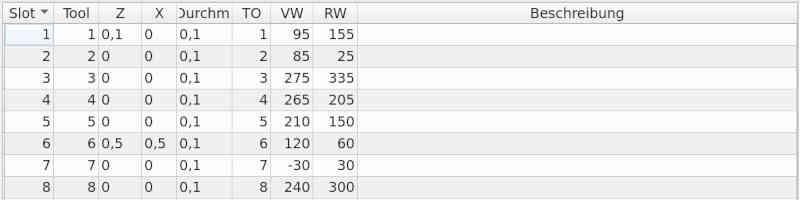
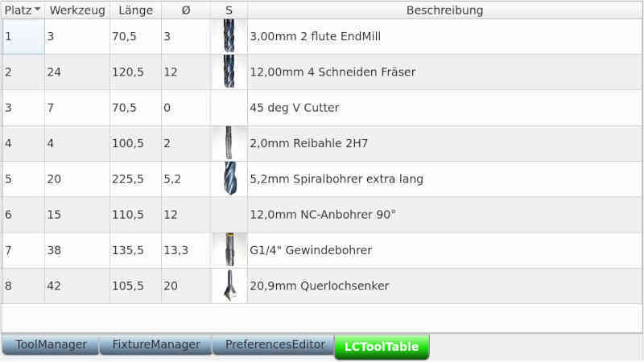

# Werkzeugverwaltung für linuxCNC

Die Werkzeug-Verwaltung der linuxCNC-Werkzeuge gibt es in zwei unterschiedlichen
Ausführungen (je nachdem welche Maschine konfiguriert ist).
Die Felder können in der Tabelle bearbeitet werden. Die Liste wechselt dann in
Bearbeitungsmodus. **[F10]** speichert die Änderung, **[Esc]** verwirft die
Änderung.

- Werkzeug-Verwaltung für Drehmaschinen

Die Felder im einzelnen:

  - *Platz* ist der Platz im Revolver
  - *Z* der Offset in Z-Richtung
  - *X* der Offset in X-Richtung
  - *Durchmesser* ist der Durchmesser an der Werkzeugspitze
  - *Q* ist der Quadrant der Werkzeug-Ausrichtung
  - *FW* ist der Front-Winkel
  - *RW* ist der Rück-Winkel

- Werkzeug-Verwaltung für Fräsen

Die Felder im einzelnen:

  - *Platz* ist der Platz im Werkzeugwechsler
  - *Länge* ist die Länge in Z-Richtung
  - *Durchm* ist der Werkzeug-Durchmesser
  - *S* ist das Symbol des Werkzeuges
