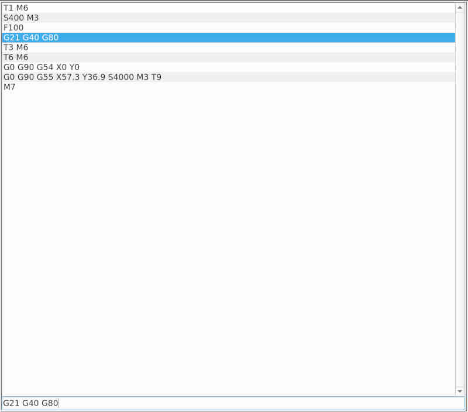

# MDI editor 

## manual data input

In the overview the last used commands are listed. Below the overview there is an input field where the commands can be written.
With [arrow keys] up/down commands can be selected from the list. Selected commands are copied to the input line where they can be changed.

Only what is written in the input line is executed. The execution is started with the Start key .

The list of the last commands is saved when exiting the application.

