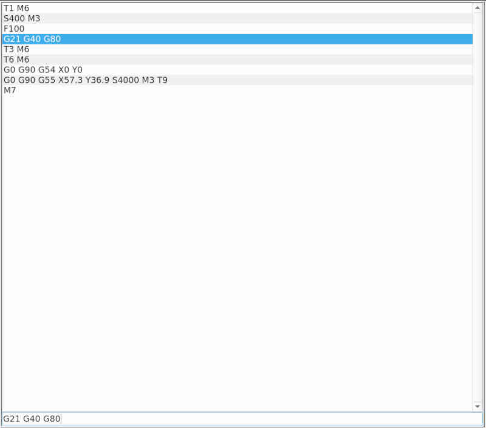

# MDI-Editor 

## manuelle Befehlseingabe

In einer Übersicht werden die zuletzt verwendeten Befehle aufgeführt. Unter der Übersicht gibt es eine Eingabezeile, in der die Befehle geschrieben werden können.
Mit [Pfeiltasten] hoch/runter lassen sich Befehle aus der Liste auswählen. Ausgewählte Befehle werden in die Eingabezeile kopiert, wo sie geändert werden können.

Ausgeführt wird das, was in der Eingabezeile steht.
Die Ausführung wird mit der Start-Taste  gestartet.

Die Übersicht der letzten Befehle wird beim Verlassen der Anwendung gespeichert.

