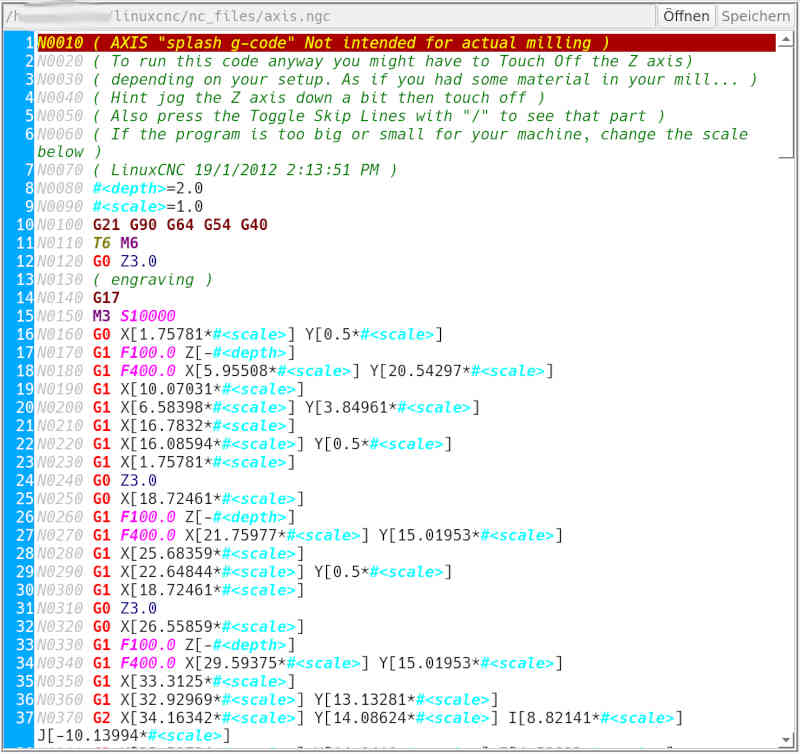

# NC-Editor

Es gibt 2 NC-Editoren in **FalconView**:
- einen für die aktive NC-Datei, also der Job, der ausgeführt werden soll
- einen unabhängigen, um auch während der Job-Verarbeitung Änderungen an anderen
Dateien durchführen zu können.

Dateiänderungen können mit **[F10]** gespeichert oder mit **[Esc]** verworfen werden.

Wenn zum NC-Editor gewechselt wird, dann ist der *Öffnen*-Knopf aktiv. **[Leertaste]**
reicht aus um die Aktion auszuführen. Zur Datei-Auswahl wird der
[Datei-Verwalter](filemanager.html) verwendet.

