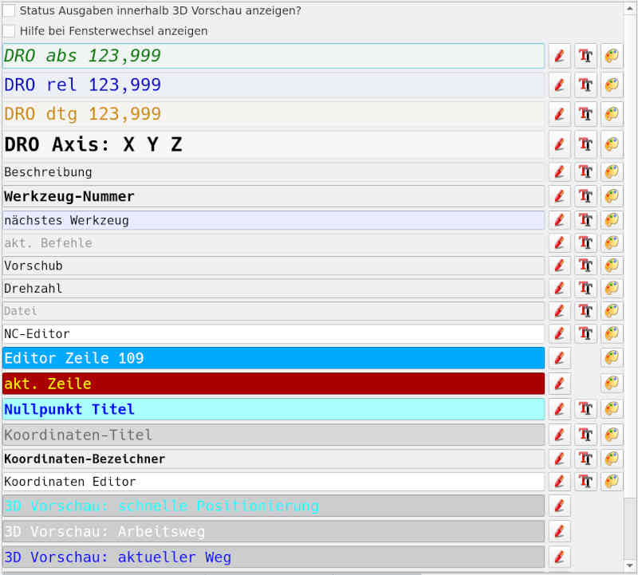

# Settings

Here important behavior and/or application colors can be changed.

With **[arrow key up]**, respectively **[arrow key down]** the subject of the
color can be changed. Arrived at the desired subject the following
keyboard shortcuts are supported:

- **[Alt + C]** changes the font or line color.
- **[Alt + B]** changes the background color
- **[Alt + F]** changes font (-type, -size, -style)

