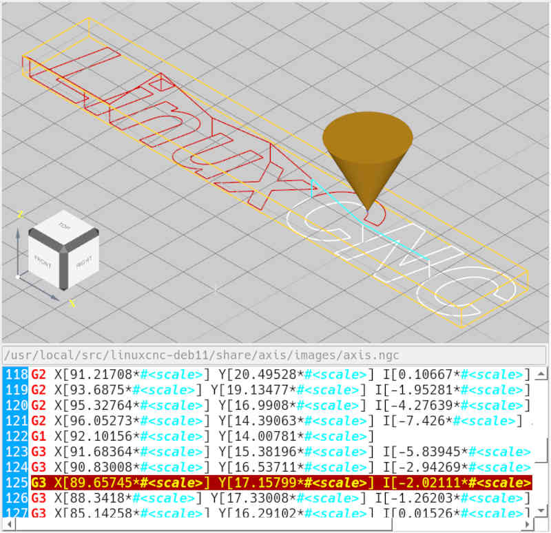

# 3D preview

The preview shows the (expected) toolpaths of the active NC file.
In the lower area, the associated NC file is displayed.
When the NC file is executed, the line that is currently being executed is highlighted. The toolpaths in the preview changes color, depending on
whether a path is currently being executed or has already been executed. The colors can be configured in the system settings .

The toolpaths can be viewed from different angles. For
changing the view angle use the following keyboard shortcuts:

- **[Ctrl + T]** - View from top.
- **[Ctrl + R]** - View from right side
- **[Ctrl + L]** - view from the left
- **[Ctrl + F]** - Front view
- **[Ctrl + B]** - View from behind
- **[Ctrl + 3]** - 3D view

**[F]** without additional key can be used to fit the workpiece into the
window (zoom)

