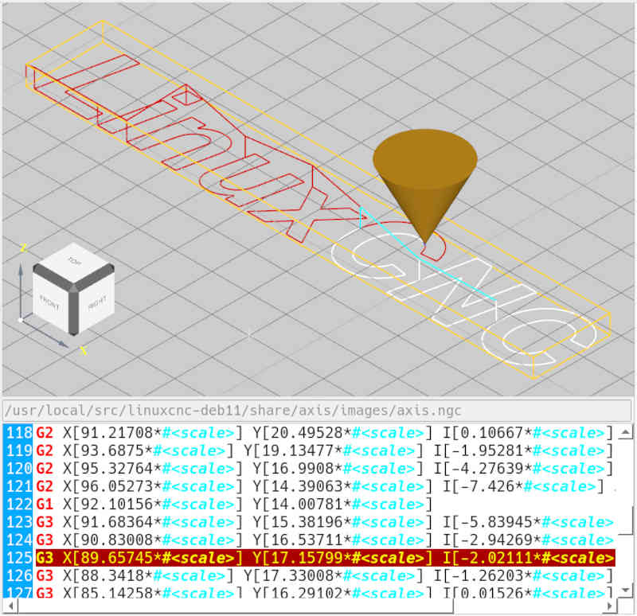

# 3D-Vorschau 

In der Vorschau werden die (*erwarteten*) Werkzeugwege der aktiven NC-Datei angezeigt.
Im unteren Bereich wird die dazugehörige NC-Datei angezeigt.
Bei der Ausführung der NC-Datei wird immer die Zeile hervorgehoben, die aktuell
ausgeführt wird. Die Werkzeugwege in der Vorschau änderen die Farbe, je nachdem
ob ein Weg gerade ausgeführt wird oder schon ausgeführt wurde. Die Farben lassen
sich in den Einstellungen  ändern.

Die Werkzeugwege lassen sich aus unterschiedlichen Winkeln betrachten. Zum
Ändern der Ansicht gibt es folgende Tastaturkürzel:

- **[Strg + T]** - Ansicht von oben
- **[Strg + R]** - Ansicht von rechts
- **[Strg + L]** - Ansicht von links
- **[Strg + F]** - Ansicht von vorne
- **[Strg + B]** - Ansicht von hinten
- **[Strg + 3]** - 3D-Ansicht
- **[F]** ohne Zusatztaste kann verwendet werden, um das Werkstück in das
Fenster einzupassen (Zoom)

