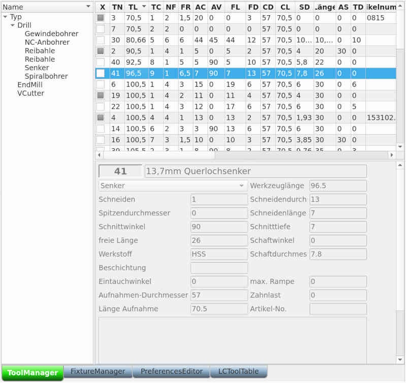

# System settings

In the system settings there are several sub-areas, which are marked by tabs.
The first (from the left) tab has the keyboard shortcut **[Alt + 1]**, the second **[Alt + 2]** and so on ...

