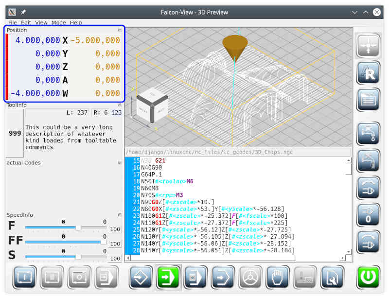

# Position display

The position display is a movable mini window.

The position display shows the position of the tool tip relative to the workpiece. This is the left column of numbers. The lines of the position display correspond to the configured axes of the machine (ini-file of *linuxCNC*). The left column can be switched , so that the absolute coordinates are displayed instead of the position relative to the workpiece.

The red bars on the far left show that the axes have not (yet) been referenced. A referenced axis has a green bar. Only referenced axes show reliable position information.

To the right of the axis identifier, the distance-to-go per axis is displayed. Distance-to-go is the distance that the tool still has to move with the current command.

