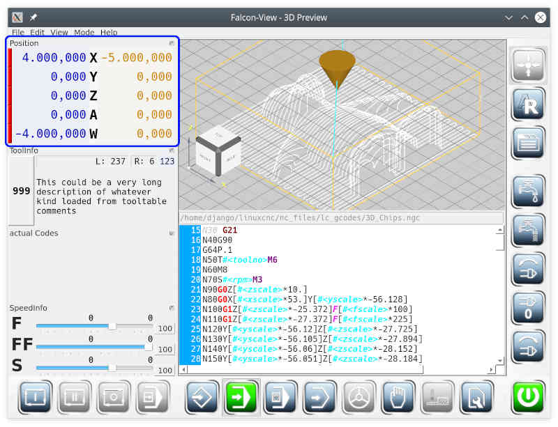

# Positions-Anzeige

Die Positionsanzeige ist ein verschiebbares Minifenster.

In der Positionsanzeige wird die Position des Werkzeuge relativ zum Werkstück angezeigt. Das ist die linke Zahlenspalte. Die Zeilen der Positionsanzeige entspricht den konfigurierten Achsen der Maschine (Ini-Datei von *linuxCNC*). Die linke Zahlenspalte kann umgeschaltet werden , sodass nicht die Position relativ zum Werkstück sondern die absoluten Koordinaten angezeigt werden

Die roten Balken ganz links zeigen, dass die Achsen (noch) nicht referenziert wurden. Eine referenzierte Achse hat einen grünen Balken. Nur bei referenzierten Achsen ist die Positionsangabe verlässlich.

Rechts der Achsenbezeichner wird der Restweg pro Achse angezeigt. Restweg ist der Weg, den das Werkzeug bei aktuellem Befehl noch verfahren muss.

