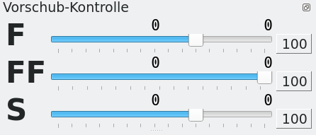

# Machining Info

The machining info is a sliding mini window.

- **F** - is the working feed
- **FF** - is the rapid traverse (for positioning)
- **S** - is the speed of the tool spindle

to the right of the shifting slider the position of the slider is displayed in percent. Above it, the programmed speed is displayed on the right and the current feed value is displayed on the left. This value only deviates from the setpoint if the slider is not at 100%.

