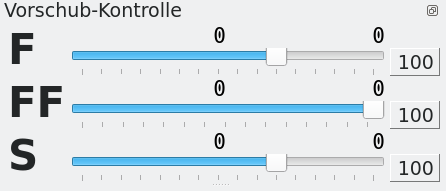

# Zerspanungs-Info

Die Zerspanungs-Info ist ein verschiebares Minifenster.

- **F** - ist der Arbeitsvorschub
- **FF** - ist der Eilgang (zur Positionierung)
- **S** - ist die Drehzahl der Werkzeugspindel

rechts des Verschiebereglers wird die Position des Schiebereglers in Prozent angezeigt. Darüber wird rechts der programmierte Sollwert angezeigt und links davon der aktuelle Wert. Dieser Wert weicht nur vom Sollwert ab, wenn der Schieberegler nicht auf 100% steht.

