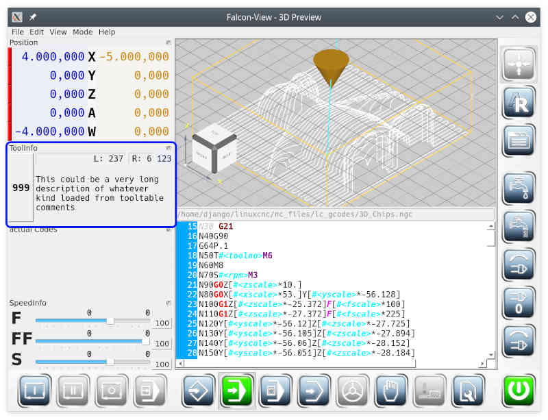

# Tool Info

Tool info is a movable mini window.

It shows the properties of the active tool. The leftmost box shows the tool number. After *L:* the tool length and after *R:* the radius of the tool is shown. Below that the description of the tool is displayed.

The rightmost number shows the tool number of the next tool.

