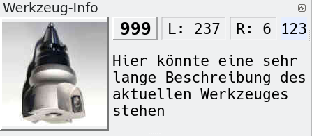

# Tool Info

Tool info is a movable mini window.

It shows the properties of the active tool. The leftmost number shows the tool number. After *L:* the tool length and after *R:* the radius of the tool is shown. Below that is the description of the tool.

The rightmost box shows the tool number of the next tool.

Picture support is described at [LCToolTable](lctooltable).
