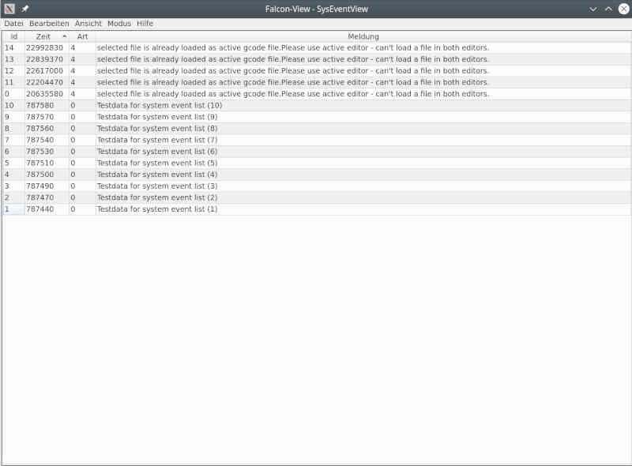

# System System Events 

shows an overview of the system events. The table has purely informative character, i.e. nothing can be edited.

It is used to trace the system events and to acknowledge errors.

In the event of an error, the entire machine goes into error state, i.e. further (incorrect) operation is denied. Only when the error has been acknowledged, the machine can continue operating.

