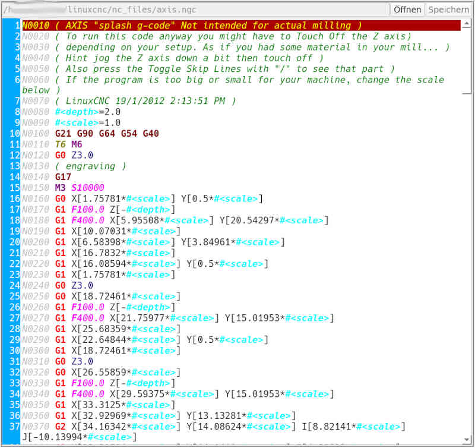

# zusätzlicher NC-Editor 

Der zusätzliche NC-Editor dient als Hilfsmittel, wenn während einer langandauernden Bearbeitung eine weitere Datei bearbeitet werden soll.
Der zusätzliche NC-Editor ist nicht mit der automatischen Verarbeitung gekoppelt. Eine Datei die im Haupteditor geladen, bzw. ausgeführt wird, kann nicht im zusätzlichen Editor geladen werden.

Wird der NC-Editor aktiviert, ist der *Öffnen*-Knopf aktiv. **[Leertaste]**
reicht aus um die Aktion auszuführen. Zur Datei-Auswahl wird der
[Datei-Verwalter](filemanager) verwendet.

Unterstützte Tastenkombinationen:

- **[Strg + S]** speichert geänderte Dateien. Dabei wird die bisherige Datei als Backup umbenannt.

- **[Strg + F]** öffnet einen Eingabedialog um nach einem Text zu suchen.

Es gibt 2 NC-Editoren in **FalconView**:
- einen für die aktive NC-Datei , also der Job, der ausgeführt werden soll
- einen unabhängigen , um auch während der Job-Verarbeitung Änderungen an anderen Dateien durchführen zu können.

