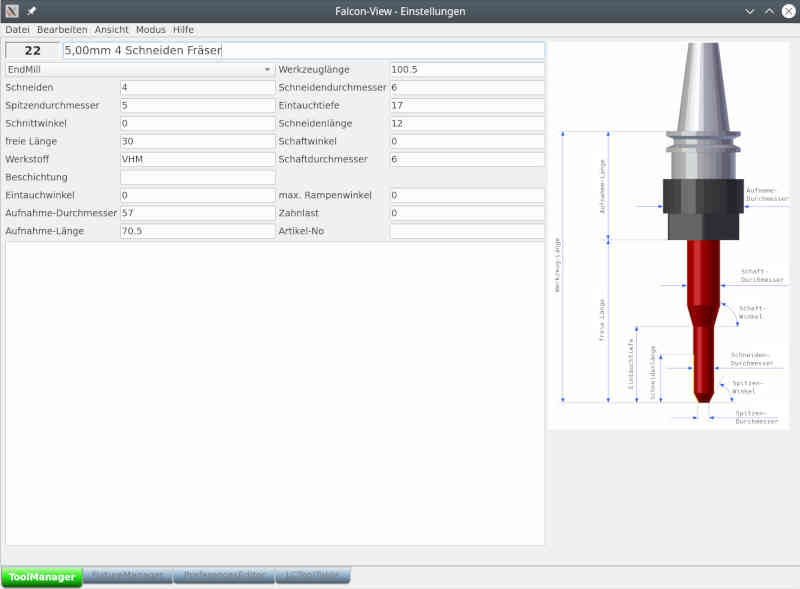

# Tool properties

The properties are explained in the image to the right of the editor. All properties except the **tool number** can be changed. The **tool length** cannot be entered, because the value is calculated from the other two (see drawing).
