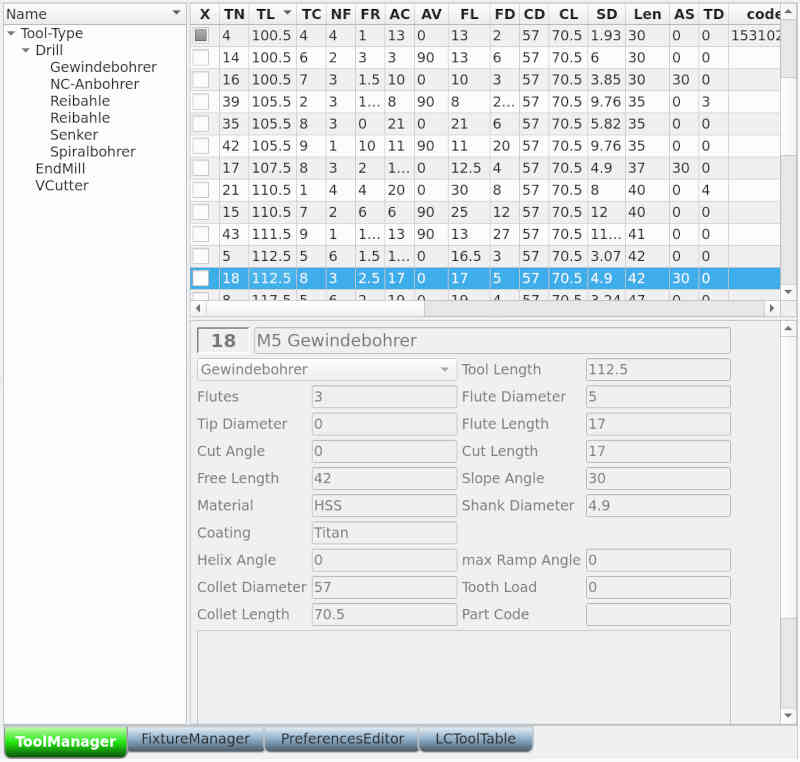

# allgemeine Werkzeug-Verwaltung

wurde für Maschinen mit Wechslerspindel entwickelt, um Werkzeugdaten unabhängig
von NC-Jobs und/oder Cam-System zu verwalten. Bei Maschinen mit konventioneller Spindel, bei denen das Werkzeug nach jedem Wechsel neu eingemessen werden muss, kann die allgemeine Werkzeug-Verwaltung in den Systemeinstellungen  abgeschaltet werden.

Um Werkzeuge übersichtlich zu verwalten, können Werkzeug-Kategorien erstellt werden. Jeder Anwender kann Kategorien nach seinen Vorstellungen und Wünschen erstellen. Dazu gibt es keine Vorgaben.

Im linken Bereich wird die Hierarchie der Werkzeug-Kategorien als Baum dargestellt.
Rechts oben entsprechend die Werkzeugliste zur ausgewählten Kategorie. Ausnahme ist die Baumwurzel, die vom System vorgegeben wird. Ist diese ausgewählt, werden alle Werkzeuge in der rechten Liste angezeigt.

Rechts im unteren Bereich werden die Werkzeugdaten übersichtlich dargestellt, d.h. mit lesbaren Bezeichnern. **[Enter]** auf einem Werkzeug in der Liste startet den [Bearbeitungsmodus](tooleditor). Im Bearbeitungsmodus kann mit **[Tab]** zwischen den Eingabefeldern gewechselt werden. **[Escape]** bricht die Bearbeitung ab, **[F10]** speichert die Änderungen.

Weitere Tastenkombinationen nach dem Bild.

## Tastenkombinationen für die Werkzeug-Verwaltung

- **[Tab]** - wechsel zwischen Baum und Werkzeugliste

- **[Enter]** - in der Werkzeugliste wechselt in den Bearbeitungsmodus für die Werkzeugeigenschaften. Im Kategorie-Baum wird [Enter] verwendet, um eine Kopier- bzw. Verschiebe-Aktion abzuschließen.

- **[Einfg]** in der Kategorie-Übersicht gedrückt erstellt eine neue Kategorie, in der Werkzeug-Übersicht gedrückt erstellt es ein neues Werkzeug.

- **[Entf]** in der Kategorie-Übersicht gedrückt löscht es die Kategorie (wenn sie keine Werkzeuge enthält), in der Werkzeugliste gedrückt löscht es das Werkzeug.

- **[Esc]** - beendet den Bearbeitungsmodus der Werkzeugeigenschaften ohne die Änderungen zu speichern.

- **[F6]** in der Kategorie-Übersicht gedrückt dient es dem Umbenennen einer Kategorie

- **[F9]** startet den Export der ausgewählten Werkzeuge. Derzeit wird nur das Format von LinuxCNC unterstützt und es wird die aktuelle Werkzeugdatei überschrieben. Die bisherige Werkzeugliste wird natürlich vorher gesichert.

- **[F10]** - beendet den Bearbeitungsmodus der Werkzeugeigenschaften und speichert die Änderungen.

- **[Leertaste]** in der Kategorie-Übersicht öffnet/schließt es die Kind-Ansicht, in der Werkzeugliste dient es dem Auswählen eines Werkzeuges für den Export
